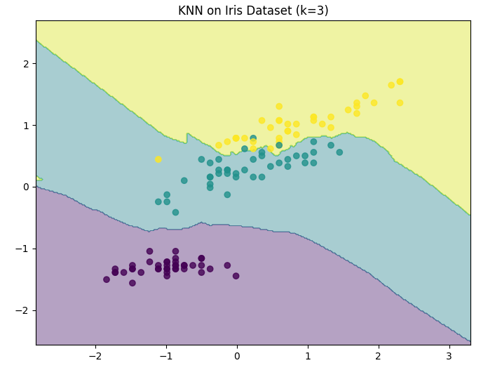
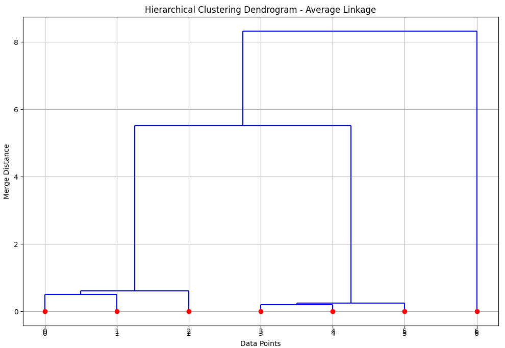
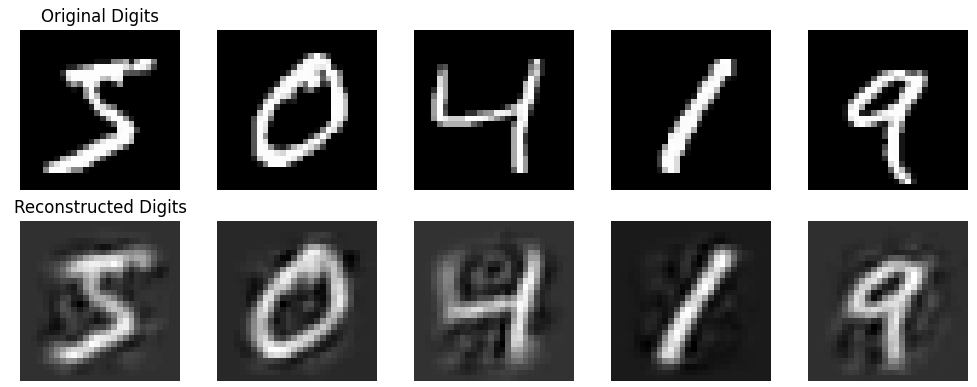
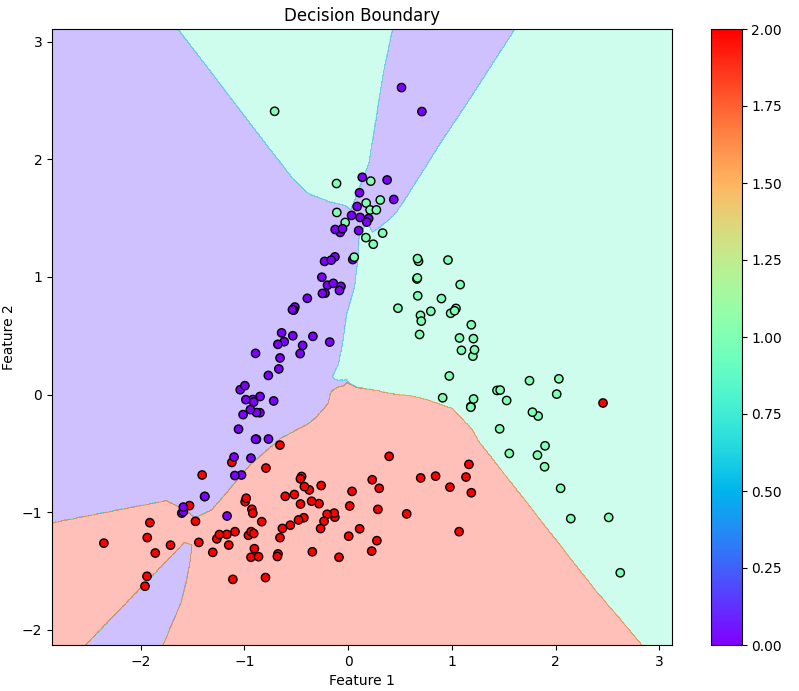

# Machine Learning Algorithms from Scratch

A Python project implementing machine learning algorithms from scratch using NumPy. This repository is designed for educational purposes, emphasizing transparency and understanding over abstraction.

## 🚀 Getting Started

Requirements  
Python: Version 3.8 or newer (tested on 3.8–3.11)  
Dependencies: See requirements.txt

### Installation:

```bash
# Clone the repository
git clone https://github.com/yourusername/ml-algorithms-from-scratch.git

# Navigate to the project directory
cd ml-algorithms-from-scratch

# Install dependencies
pip install -r requirements.txt
```

## Run All Tests

```bash
pytest
```

## Project Structure

-   **`ml/`**: Core implementations of machine learning algorithms.
-   **`examples/`**: Example scripts showcasing the usage of various models.
-   **`tests/`**: Unit tests to validate the correctness of implementations.
-   **`docs/`**: Documentation and additional resources for reference.

## Models Details

**K-Nearest Neighbors (KNN)**

-   Euclidean distance metric
-   Majority voting mechanism
-   Supports multi-class classification

The `knn_usage.py` script demonstrates the K-Nearest Neighbors implementation with decision boundary plots comparing different k values for synthetic and Iris dataset.


<br/>

**Logistic Regression**

-   Gradient Descent optimization
-   Early stopping mechanism
-   Lambda regularization
-   Configurable learning rates

The `logistic_regression_usage.py` script demonstrates binary classification using the Cleveland Heart Disease dataset from UCI Machine Learning Repository.

**Random Forest**

-   Supports both classification and regression tasks
-   Decision tree-based ensemble learning
-   Configurable tree height
-   Error calculation:
    -   MSE for regression
    -   Error rate for classification

The `random_forest_usage.py` script demonstrates both classification (using the Iris dataset) and regression (using California housing dataset) using the Random Forest implementation.

**Hierarchical Clustering**

-   Agglomerative (bottom-up) clustering approach
-   Multiple linkage criteria
-   Dendrogram visualization support
-   Flexible cluster extraction at any level

The `hierarchical_clustering_usage.py` script demonstrates clustering capabilities with dendrogram visualization.


<br/>

**Principal Component Analysis (PCA)**

-   Data centering and projection
-   Variance explanation analysis
-   Dimensionality reduction
-   Data reconstruction

The `pca_usage.py` script demonstrates the PCA implementation with MNIST dataset featuring Original vs reconstructed data visualization and cumulative explained variance plots.


<br/>

**Support Vector Machine (SVM)**

-   Binary classification using maximum margin hyperplane
-   Sequential Minimal Optimization (SMO) for training
-   Kernel functions for non-linear classification
-   Support for both linear and Gaussian (RBF) kernels
-   Regularization parameter C for controlling margin softness

The `svm_usage.py` script demonstrates the SVM implementation with data preprocessing and feature scaling, model training with linear kernel with e-mail spam dataset and evaluation metrics.

**Multilayer Perceptron (MLP)**

-   Neural network architecture for supervised learning
-   Forward and backward propagation with gradient descent
-   Supports binary and multi-class classification
-   Activation functions: Sigmoid, ReLU, and Softmax
-   Model training with backpropagation and cost minimization

The `mlp_usage.py` script demonstrates the MLP implementation with training and test accuracy reports, decision boundary visualizations for classification tasks, predictions and performance evaluation metrics with a synthetic dataset.


<br/>

**K-Means Clustering**

-   Iterative algorithm
-   Minimizes the sum of squared distances between points and cluster centers
-   Supports various distance metrics (Euclidean, Manhattan)
-   Flexible number of clusters

The `k_means_clustering_usage.py` script demonstrates clustering capabilities with visualizations.

<br/>

**Naive Bayes**

-   Probabilistic classifier based on Bayes' theorem
-   Assumes feature independence
-   Supports Gaussian, Multinomial, and Bernoulli distributions
-   Suitable for high-dimensional data

The `naive_bayes_usage.py` script demonstrates the Naive Bayes implementation with the Spambase dataset.

<br/>

## 🤝 Contributing

We welcome contributions! Check out the Contributing Guide for details on how to get started.

## 📝 License

This project is licensed under the MIT License. See the LICENSE file for more details.
